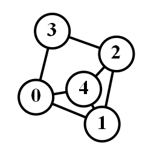

# GradProject
我的本科毕业设计 - 基于 Graphviz + Qt 的数据结构可视化实现  

本项目具体实现了以下数据结构的可视化
* 链表
    * 带头结点的单链表
    * 不头结点的单链表
* 树
    * 二叉树
    * 二叉搜索树
    * 大/小 堆
    * 哈夫曼树
* 图 (不完善)
    * 有向图
    * 无向图
* 自动出题(根据指定的树结点个数生成)
    * 树的 前中后 遍历
    * 树的构造 (根据前、中序列构造,根据中、后序列构造)
    * 哈夫曼树的生成

效果图:
* 单链表
    
* 二叉树
    
* 图  
    